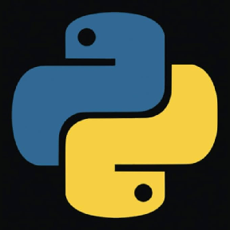
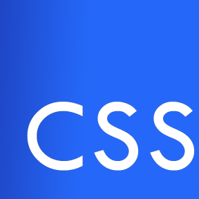

### Обо мне:
- я Junior разработчик
- Меня зовут Саня, я живу в Москве.
- Любимые клавиши: <kbd>**Ctrl + C**</kbd> <kbd>**Ctrl + V**</kbd> <kbd>**Ctrl + Z**</kbd> <kbd>**Alt + F4**</kbd>
- Я программист, и учу эти языки: **HTML** **CSS** **JS**
- Я ~~НЕНАВИЖУ~~ ЛЮБЛЮ **JS**
- <code>for (i = 1; true; i++){
  console.log(`Я люблю js на ${i}%`)}</code>

### :computer: Статистика:

### Я использую :computer: :

  <code></code>
  <code></code>
  <code></code>
  <code></code>
  <code></code>

### Мои друзья:

